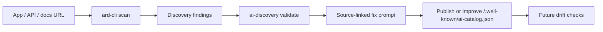

# AssetMason Agent Tools

> Preview ARD / AI Catalog readiness tools for making apps, APIs, docs, MCP servers, and workflows easier for agents to discover, understand, and use.


AssetMason Agent Tools are local-first developer tools for inspecting and improving agent-operability signals such as `/.well-known/ai-catalog.json`.

## Why this exists

Agents need more than webpages. They need source-linked machine-readable surfaces that tell them what resources exist, what tasks or capabilities they support, where authoritative docs or protocol handoffs live, and what is unsupported or uncertain.

## Packages

| Package | Use it for | Status |
| --- | --- | --- |
| `ard-kit` | Shared schemas, validators, fixtures, and helpers | Preview |
| `ai-discovery` | Validate, explain, and draft `ai-catalog.json` discovery assets | Preview |
| `ard-cli` | Umbrella CLI for ARD readiness checks and source-linked diagnostics | Preview |

## Quickstart

Before preview publish, use local workspace commands.

```bash
npm install
npm run typecheck
npm run lint
npm test
npm run build
npm run pack:dry-run
```

After preview publish:

```bash
npx -y ai-discovery@preview --help
npx -y ai-discovery@preview validate https://example.com/.well-known/ai-catalog.json

npx -y ard-cli@preview --help
npx -y ard-cli@preview scan https://example.com
```

## Example workflow



## Naming

```text
npm package / npx command: ai-discovery
spec artifact: ai-catalog.json
feature label: ARD / AI Catalog readiness
```

## What these tools do not do

These tools do not certify ARD conformance, guarantee registry indexing, guarantee ranking, guarantee successful agent invocation, provide safety/legal/privacy/security/compliance certification, capture credentials, or send telemetry by default.

## Relationship to AssetMason

AssetMason’s broader mission is agent operability: making apps, APIs, docs, tools, workflows, and machine-readable surfaces discoverable, understandable, callable, and usable by external agents.

These packages are the developer-native ARD / AI Catalog readiness wedge.

## External reference

For background on the emerging Agentic Resource Discovery protocol, see the external ARD specification reference at [agenticresourcediscovery.org](https://agenticresourcediscovery.org/).

AssetMason Agent Tools are preview readiness helpers and are not an official conformance authority for ARD or AI Catalog.

## Local development

```bash
npm install
npm run typecheck
npm run lint
npm test
npm run build
npm run pack:dry-run
```

## Manual preview publish

Publishing is manual and interactive:

```bash
npm login
npm whoami

npm publish --tag preview --workspace ard-kit
npm publish --tag preview --workspace ai-discovery
npm publish --tag preview --workspace ard-cli
```

Do not publish prereleases under `latest`.

## Roadmap

Next work focuses on deeper discovery bridges, scan workflows, and CI/drift checks.

Additional package names will be announced only after they are claimed, implemented, tested, documented, and ready to publish.

## Security and contributing

See [SECURITY.md](./SECURITY.md) and [CONTRIBUTING.md](./CONTRIBUTING.md).

## License

Apache-2.0.
